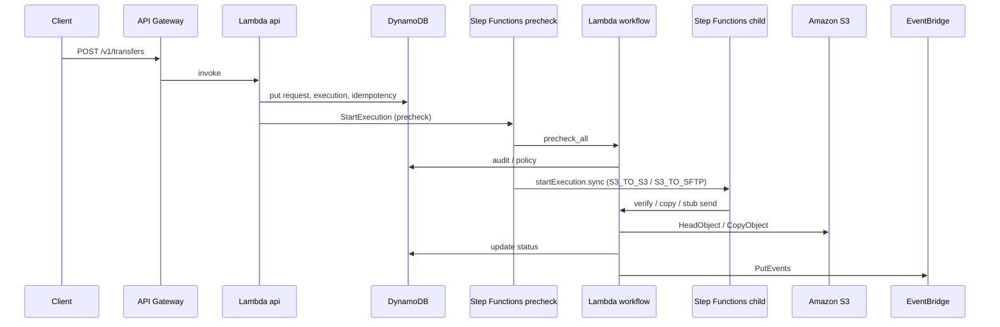
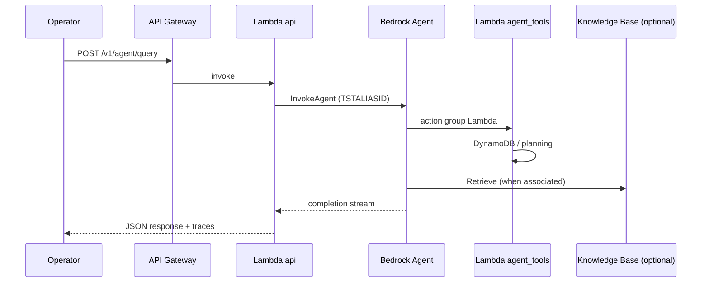

# Architecture

A consolidated **PNG diagram** of the AWS components and data flows: [bayrelay-architecture.png](bayrelay-architecture.png).

## Layered view

| Layer | Responsibility | AWS services in this repo |
|-------|----------------|---------------------------|
| A — Agent | NL understanding, tool use, policy prompts | Bedrock Agent + Lambda action groups |
| B — RAG | Curated policies, runbooks, SOPs | S3 KB source + OpenSearch Serverless + Bedrock Knowledge Base (`modules/bedrock_vector_kb`) |
| C — Execution | Transfers, orchestration, state | API Gateway, Lambda, Step Functions, DynamoDB, S3, EventBridge |
| D — Production | IaC, encryption, observability | Terraform, KMS, CloudWatch, SNS |

## End-to-end execution (Phase 1)

## Agent query path

## SFTP staging pattern (spec default for SFTP→SFTP)

Partner SFTP → S3 staging → validate/transform → S3 → partner SFTP. Direct opaque relay is intentionally not the default.

## Guardrails note

Bedrock Guardrails apply to user input and model output, not to raw retrieved KB chunks at runtime. Curate KB content and enforce bucket IAM accordingly.
