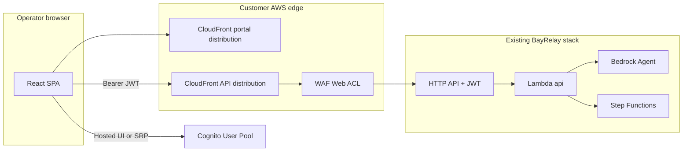

# Operator Portal MVP — scope & architecture

Add-on to BayRelay **PoC** or **Production Launch**. The reference stack stays API-only; this document defines a **minimal operator web UI** deployed in the **customer’s AWS account** (same commercial model as BayRelay).

Formal change order: [SOW_OPERATOR_PORTAL_ADDON.md](SOW_OPERATOR_PORTAL_ADDON.md) · Pricing: [PRICING.md](PRICING.md)

---

## Problem

Today operators use **curl**, **Postman**, **FileZilla**, and **AWS Console**. That works for technical demos but weakens executive and business-user adoption. The portal does **not** replace the API — it is a thin client over the existing control plane.

---

## MVP goals (v1)

| Goal | MVP feature |
|------|-------------|
| Sign in | Cognito (existing user pool / app client) |
| See work | Dashboard: recent transfers, status badges, link to detail |
| Start work | Guided **Submit transfer** (S3→S3 first; other types if time) |
| Ask policy | **Agent chat** panel → `POST /v1/agent/query` |
| Register partners | Simple forms → `POST /v1/partners`, `POST /v1/endpoints` |

**Out of MVP v1:** partner self-service login, per-partner API keys, billing UI, workflow designer, mobile app, on-prem install.

---

## Architecture



| Component | Recommendation |
|-----------|----------------|
| **Frontend** | React + TypeScript (Vite), hosted on **S3 + CloudFront** (new distribution; separate from API distribution) |
| **Auth** | Existing **Cognito** pool; **Hosted UI** or Amplify Auth for login; SPA stores ID token |
| **API** | Existing `http_api_public_endpoint`; enable **CORS** on API Gateway HTTP API for portal origin |
| **IaC** | Terraform module `modules/operator_portal` + `enable_operator_portal` in `environments/` |
| **Secrets** | None in browser; no API keys in frontend |

**Prerequisite:** BayRelay stack deployed with JWT (`enable_api_jwt_auth = true`) and public API URL.

---

## Screen map (MVP)

| # | Screen | API calls |
|---|--------|-----------|
| 1 | Login / logout | Cognito `InitiateAuth` or Hosted UI redirect |
| 2 | Dashboard | `GET` recent transfers (new list endpoint **or** poll known IDs — see gap below) |
| 3 | Transfer detail | `GET /v1/transfers/{id}` |
| 4 | New transfer | `POST /v1/partners` (if needed), endpoints, `POST /v1/transfers` + idempotency key |
| 5 | Agent assistant | `POST /v1/agent/query` (streaming optional v1.1) |
| 6 | Partners & endpoints | `POST` register; table from new list APIs or static session cache |

### API gap (included in portal SOW)

The reference API has **no list** endpoints for transfers/partners. MVP delivery includes **one** of:

- **Option A (preferred):** Add `GET /v1/transfers?limit=50` and `GET /v1/partners` to Lambda `api` (small backend change, same repo).
- **Option B:** Portal shows only transfers created in the current browser session (demo-only; not ideal for production).

Change order assumes **Option A** unless customer explicitly accepts Option B.

---

## Delivery phases

| Phase | Duration (indicative) | Deliverables |
|-------|----------------------|--------------|
| **0 — Design** | 3–5 days | Wireframes (6 screens), CORS + Cognito redirect URIs, Terraform module sketch |
| **1 — Core** | 2 weeks | Login, dashboard, transfer detail, S3→S3 submit, deploy to customer AWS |
| **2 — Agent + partners** | 1 week | Chat panel, partner/endpoint forms, list APIs if Option A |
| **3 — Hardening** | 3–5 days | Error states, loading, basic a11y, smoke E2E (Playwright), handoff doc |

**Total:** ~4–6 weeks calendar (one senior full-stack + part-time AWS), after BayRelay stack is green.

---

## Acceptance criteria

1. Operator signs in with Cognito user created by `create_cognito_operator.sh`.
2. Submits **S3→S3** transfer from UI; status reaches **SUCCEEDED** (same as `run_full_demo.sh` path).
3. Agent chat returns a grounded answer on KB policy (e.g. checksum retry = No).
4. Portal served over **HTTPS** on customer CloudFront domain (default `*.cloudfront.net` or custom ACM cert if customer supplies DNS).
5. No secrets in browser bundle; JWT only in memory / sessionStorage.
6. Provider delivers `docs/OPERATOR_PORTAL_RUNBOOK.md` + 1-hour handoff.

---

## Security (MVP)

- JWT required on all API calls (existing authorizer).
- CloudFront + WAF on portal distribution (reuse managed rule set pattern).
- CSP headers on static hosting.
- `allow_agent_trace_header` remains **false** in production.
- Portal CloudFront origin separate from API (no cookies shared).

---

## Optional v1.1 (separate quote)

| Feature | Notes |
|---------|--------|
| Custom domain + ACM | Customer DNS |
| Transfer Family status in UI | Poll execution + connector metadata |
| Streaming agent responses | Bedrock stream → SSE via thin BFF Lambda |
| Partner self-service portal | Separate SKU ($35k+) |
| Dark mode / branding | Customer logo/colors |

---

## Demo story (with portal)

1. Open portal URL → login as `demo@…`.
2. Dashboard shows last smoke transfers.
3. **New transfer** → pick partner/endpoints → submit → watch status flip to Succeeded.
4. **Ask agent** → “What is our checksum retry policy?” → **No**.
5. Show architecture slide: portal is thin layer; same Step Functions and KB underneath.

---

## Repo layout (when built)

```
portal/                 # React SPA (new)
  src/
  ...
modules/operator_portal/  # S3, CloudFront, CORS, outputs
environments/             # enable_operator_portal = true
docs/OPERATOR_PORTAL_RUNBOOK.md
```

Not started in the reference repo today — this document is the **scope** for the change order.

---

## Related

- [CUSTOMER_DEMO_READY.md](CUSTOMER_DEMO_READY.md) — API-only demos today
- [DEMO_CATALOG.md](DEMO_CATALOG.md) — curl/console demo script
- [SOW_PRODUCTION_LAUNCH_42K.md](SOW_PRODUCTION_LAUNCH_42K.md) — portal explicitly out of scope §2.2
