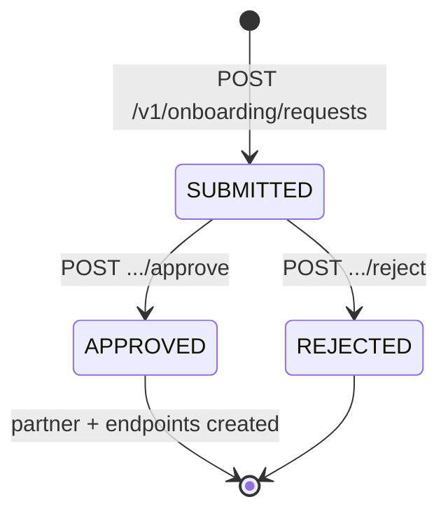

# Self-Service Customer Onboarding

Guided workflow for onboarding B2B trading partners: an operator (or future partner user) submits an application, another operator reviews it, and **approve** provisions a partner record plus endpoints in DynamoDB.

This is **operator-mediated self-service** in the Operator Portal — not a separate partner Cognito tenant (that remains the [$35k Operator Portal add-on](SOW_OPERATOR_PORTAL_ADDON.md) scope).

---

## Flow



| Step | Actor | Action |
|------|--------|--------|
| 1 | Operator | **New customer** wizard (`/onboarding/new`) — company, transfer types, optional SFTP endpoints |
| 2 | System | Stores request with status `SUBMITTED`, audit `onboarding_submitted` |
| 3 | Operator | **Onboarding inbox** (`/onboarding`) — filter, open detail |
| 4 | Operator | **Approve** → creates `partner` + `endpoints`; optional custom `partner_id` |
| 4 alt | Operator | **Reject** → optional reason; status `REJECTED` |

Default endpoints on approve (unless customized in the request):

- `S3` / `OUTBOUND`
- `S3` / `INBOUND`

---

## API (JWT, same Cognito pool as operators)

Enabled when `ENABLE_SELF_SERVICE_ONBOARDING=true` on the API Lambda (Terraform: `enable_self_service_onboarding`).

| Method | Path | Description |
|--------|------|-------------|
| `POST` | `/v1/onboarding/requests` | Create application |
| `GET` | `/v1/onboarding/requests` | List (`?status=SUBMITTED`, `?limit=50`) |
| `GET` | `/v1/onboarding/requests/{id}` | Detail |
| `POST` | `/v1/onboarding/requests/{id}/approve` | Provision partner (`{"partner_id": "..."}` optional) |
| `POST` | `/v1/onboarding/requests/{id}/reject` | Reject (`{"reason": "..."}`) |

Example create:

```bash
curl -sS -X POST "$API_URL/v1/onboarding/requests" \
  -H "Authorization: Bearer $TOKEN" \
  -H "Content-Type: application/json" \
  -d '{
    "company_name": "Acme Logistics",
    "contact_email": "edi@acme.example",
    "transfer_types": ["S3_TO_S3"],
    "notes": "PoC onboarding"
  }'
```

---

## Infrastructure

| Resource | Name pattern |
|----------|----------------|
| DynamoDB table | `{prefix}-onboarding-requests` |
| GSI | `status-submitted_at` (hash `status`, range `submitted_at`) |
| Env (API Lambda) | `ONBOARDING_REQUESTS_TABLE`, `ENABLE_SELF_SERVICE_ONBOARDING` |

Terraform:

- `modules/dynamodb/main.tf` — table + outputs
- `environments/main.tf` — IAM, API routes, Lambda env
- `environments/variables.tf` — `enable_self_service_onboarding` (default `true` in sample `terraform.tfvars`)

---

## Portal

| Route | Page |
|-------|------|
| `/onboarding` | Inbox + approve/reject panel |
| `/onboarding/new` | 3-step wizard |

Nav: **Onboarding**, **New customer** (header).

---

## Deploy / demo

Stack must be running:

```bash
./scripts/bayrelay_demo.sh start --yes --smoke
./scripts/deploy_portal.sh
```

Sign in with demo credentials from `environments/demo.env`, then open **New customer** → submit → **Onboarding** inbox → **Approve & provision** → verify partner on **Partners**.

---

## Code map

| File | Role |
|------|------|
| `app/lambdas/unified/onboarding_service.py` | Business logic |
| `app/lambdas/unified/api.py` | HTTP handlers + feature flag |
| `app/lambdas/unified/ddb.py` | `onboarding_requests_table()` |
| `portal/src/pages/OnboardingPage.tsx` | Inbox |
| `portal/src/pages/OnboardingNewPage.tsx` | Wizard |
| `tests/test_onboarding_service.py` | Unit tests |

---

## Related docs

- [OPERATIONS_DASHBOARD.md](OPERATIONS_DASHBOARD.md) — ops home screen
- [OPERATOR_PORTAL_MVP.md](OPERATOR_PORTAL_MVP.md) — portal scope
- [DEMO_CATALOG.md](DEMO_CATALOG.md) — transfer types selected during onboarding
- [CUSTOMER_DEMO_READY.md](CUSTOMER_DEMO_READY.md) — start/stop stack
