# BayRelay sequence diagrams — customer use cases & features

Complete sequence diagrams for BayRelay control plane, execution, automation, onboarding, portal, and agent flows.  
Companion: [ARCHITECTURE.md](ARCHITECTURE.md) · [DEMO_CATALOG.md](DEMO_CATALOG.md) · [SELF_SERVICE_AND_AUTOMATION.md](SELF_SERVICE_AND_AUTOMATION.md)

Render Mermaid in GitHub, VS Code, or [mermaid.live](https://mermaid.live).

**PNG exports:** all **31** diagrams are in [`sequence-diagrams/png/`](sequence-diagrams/png/) (regenerate: `./scripts/export_sequence_diagram_pngs.sh`).

---

## Index

| ID | Diagram | PNG | Category |
|----|---------|-----|----------|
| [UC-00](#uc-00-customer-journey-overview) | Customer journey overview | [png](sequence-diagrams/png/UC-00.png) | Overview |
| [UC-P01](#uc-p01-operator-portal-sign-in) | Operator portal sign-in | [png](sequence-diagrams/png/UC-P01.png) | Platform |
| [UC-P02](#uc-p02-partner-portal-sign-in-scoped-api) | Partner portal sign-in | [png](sequence-diagrams/png/UC-P02.png) | Platform |
| [UC-P03](#uc-p03-api-call-without-jwt-rejected) | Unauthenticated API | [png](sequence-diagrams/png/UC-P03.png) | Platform |
| [UC-C01](#uc-c01-register-partner-and-endpoints) | Register partner & endpoints | [png](sequence-diagrams/png/UC-C01.png) | Control plane |
| [UC-C02](#uc-c02-routing-policy-deny-blocks-transfer) | Routing policy DENY | [png](sequence-diagrams/png/UC-C02.png) | Control plane |
| [UC-T00](#uc-t00-manual-transfer-submit-common-path) | Manual transfer (common path) | [png](sequence-diagrams/png/UC-T00.png) | Transfers |
| [UC-T01](#uc-t01-s3--s3-transfer) | S3 → S3 | [png](sequence-diagrams/png/UC-T01.png) | Transfers |
| [UC-T02](#uc-t02-s3--sftp-transfer) | S3 → SFTP | [png](sequence-diagrams/png/UC-T02.png) | Transfers |
| [UC-T03](#uc-t03-sftp--s3-transfer) | SFTP → S3 | [png](sequence-diagrams/png/UC-T03.png) | Transfers |
| [UC-T04](#uc-t04-sftp--sftp-relay-transfer) | SFTP → SFTP | [png](sequence-diagrams/png/UC-T04.png) | Transfers |
| [UC-T05](#uc-t05-idempotent-transfer-resubmit) | Idempotent resubmit | [png](sequence-diagrams/png/UC-T05.png) | Transfers |
| [UC-T06](#uc-t06-retry-failed-transfer) | Retry transfer | [png](sequence-diagrams/png/UC-T06.png) | Transfers |
| [UC-T07](#uc-t07-cancel-in-flight-transfer) | Cancel transfer | [png](sequence-diagrams/png/UC-T07.png) | Transfers |
| [UC-A01](#uc-a01-automation-s3--s3-on-object-created) | Automation S3→S3 | [png](sequence-diagrams/png/UC-A01.png) | Automation |
| [UC-A02](#uc-a02-automation-chain-s3--sftp--sftp--s3) | Automation S3→SFTP→SFTP→S3 | [png](sequence-diagrams/png/UC-A02.png) | Automation |
| [UC-A03](#uc-a03-automation-sftp--sftp-on-connector-staging) | Automation SFTP→SFTP | [png](sequence-diagrams/png/UC-A03.png) | Automation |
| [UC-A04](#uc-a04-partner-sftp-inbound--s3--s3-automation) | Inbound SFTP → S3→S3 | [png](sequence-diagrams/png/UC-A04.png) | Automation |
| [UC-O01](#uc-o01-partner-submits-onboarding-request) | Partner onboarding submit | [png](sequence-diagrams/png/UC-O01.png) | Onboarding |
| [UC-O02](#uc-o02-operator-approves-onboarding) | Operator approve onboarding | [png](sequence-diagrams/png/UC-O02.png) | Onboarding |
| [UC-O03](#uc-o03-onboarding-auto-approve-demo) | Auto-approve (demo tfvars) | [png](sequence-diagrams/png/UC-O03.png) | Onboarding |
| [UC-O04](#uc-o04-operator-rejects-onboarding) | Reject onboarding | [png](sequence-diagrams/png/UC-O04.png) | Onboarding |
| [UC-PO01](#uc-po01-operator-operations-dashboard) | Operations dashboard | [png](sequence-diagrams/png/UC-PO01.png) | Portal |
| [UC-PO02](#uc-po02-operator-creates-transfer-rule) | Create automation rule | [png](sequence-diagrams/png/UC-PO02.png) | Portal |
| [UC-PO03](#uc-po03-portal-partner-endpoint-crud) | Partner/endpoint CRUD | [png](sequence-diagrams/png/UC-PO03.png) | Portal |
| [UC-G01](#uc-g01-bedrock-agent-query-with-tools) | Agent query + tools | [png](sequence-diagrams/png/UC-G01.png) | Agent |
| [UC-G02](#uc-g02-kb-grounded-policy-answer) | KB-grounded answer | [png](sequence-diagrams/png/UC-G02.png) | Agent |
| [UC-G03](#uc-g03-knowledge-base-sync-and-ingestion) | KB sync & ingestion | [png](sequence-diagrams/png/UC-G03.png) | Agent |
| [UC-S01](#uc-s01-partner-upload-via-managed-sftp-server) | Partner SFTP upload | [png](sequence-diagrams/png/UC-S01.png) | SFTP inbound |
| [UC-M01](#uc-m01-audit-trail-and-list-audit-events) | Audit trail | [png](sequence-diagrams/png/UC-M01.png) | Operations |
| [UC-M02](#uc-m02-ops-summary-dashboard-data) | Ops summary | [png](sequence-diagrams/png/UC-M02.png) | Operations |

---

## UC-00: Customer journey overview

High-level path for a new trading partner through BayRelay.

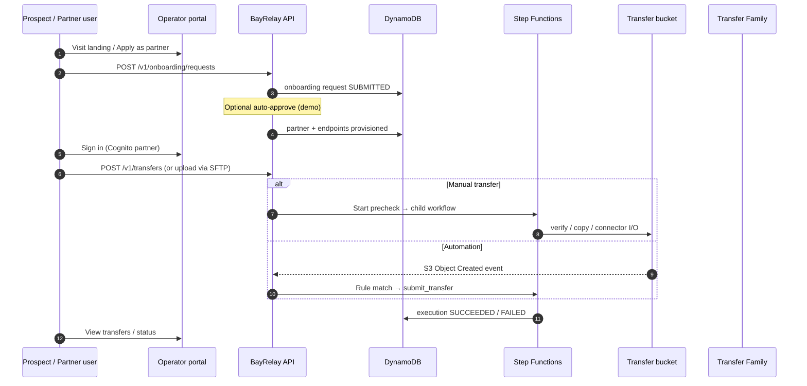

---

## Platform & security

### UC-P01: Operator portal sign-in

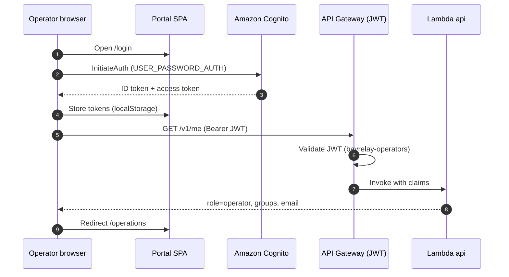

### UC-P02: Partner portal sign-in (scoped API)

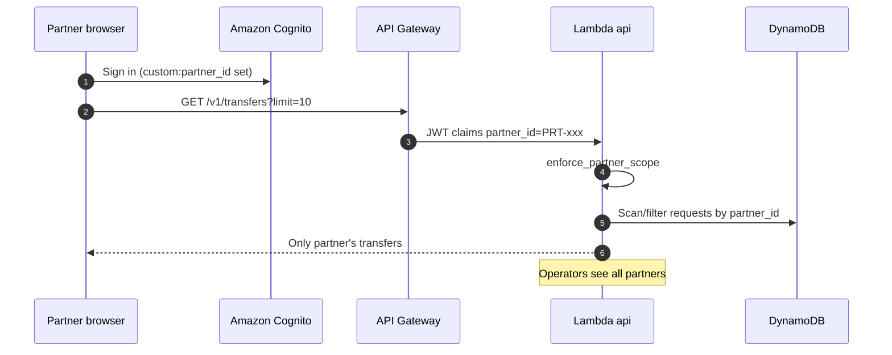

### UC-P03: API call without JWT rejected

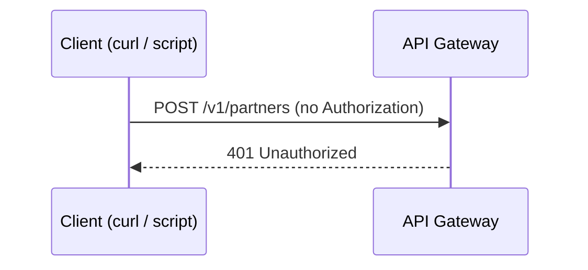

---

## Control plane

### UC-C01: Register partner and endpoints

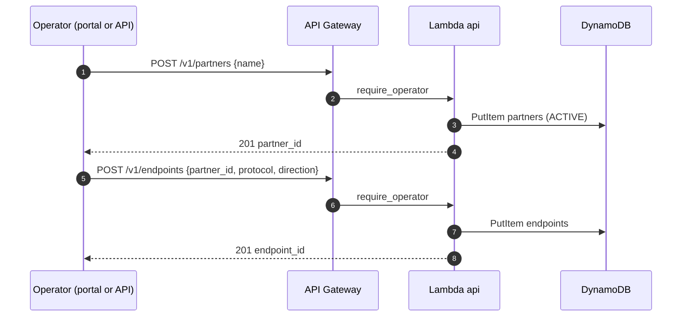

### UC-C02: Routing policy DENY blocks transfer

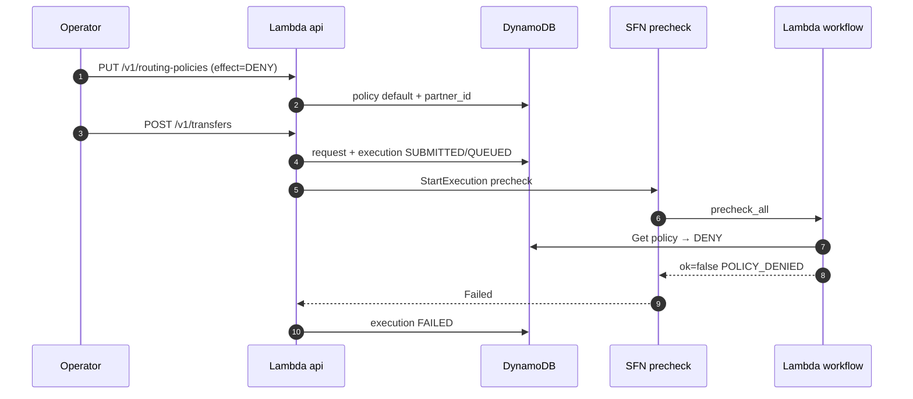

---

## Transfers — manual submit

### UC-T00: Manual transfer submit (common path)

Applies to all four `transfer_type` values; child workflow differs after precheck route.

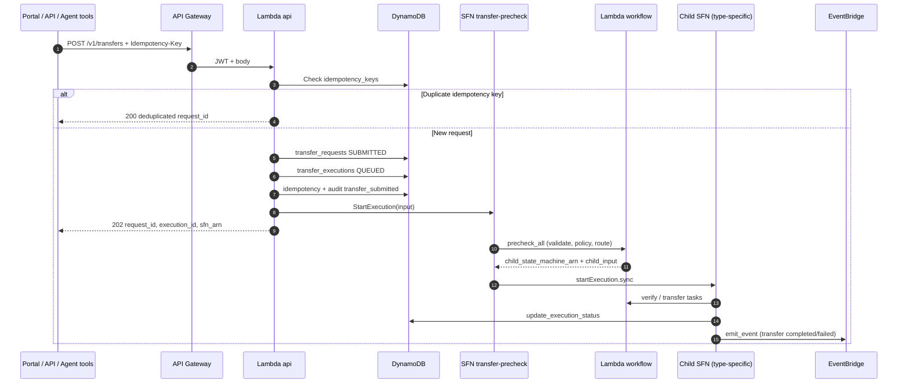

### UC-T01: S3 → S3 transfer

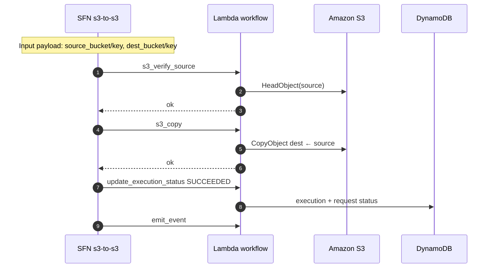

### UC-T02: S3 → SFTP transfer

Stages a flat key under the transfer bucket, then uses **Transfer Family connector** `SendFilePaths` to remote SFTP.

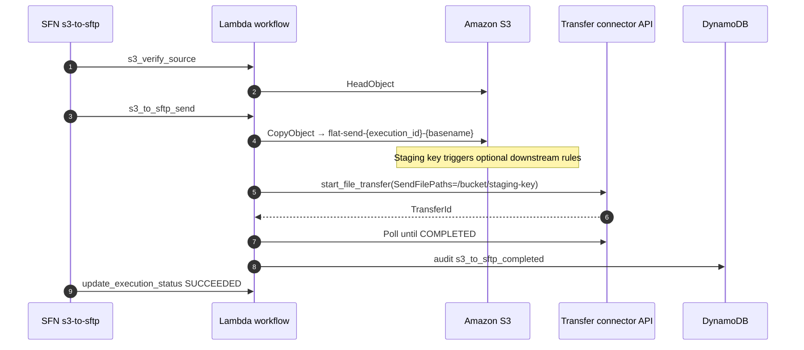

### UC-T03: SFTP → S3 transfer

Typically triggered after S3→SFTP created a connector staging object; retrieves from remote `/basename` into S3 prefix.

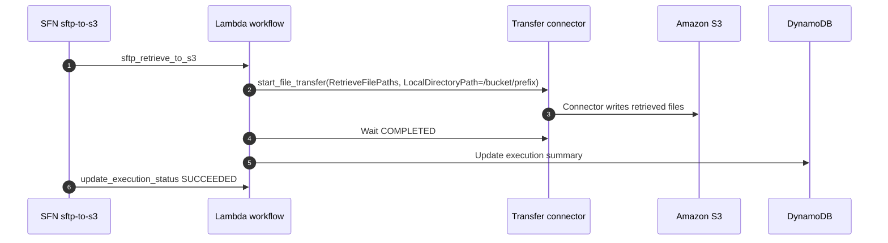

### UC-T04: SFTP → SFTP relay transfer

Retrieve remote → S3 staging → send to remote destination directory (same connector).

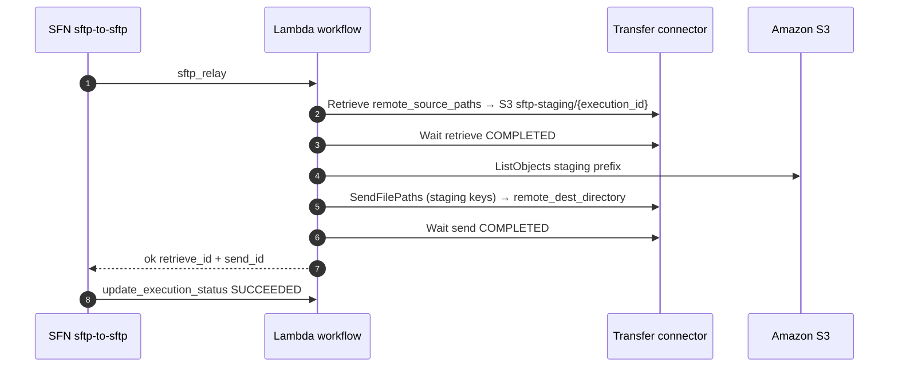

### UC-T05: Idempotent transfer resubmit

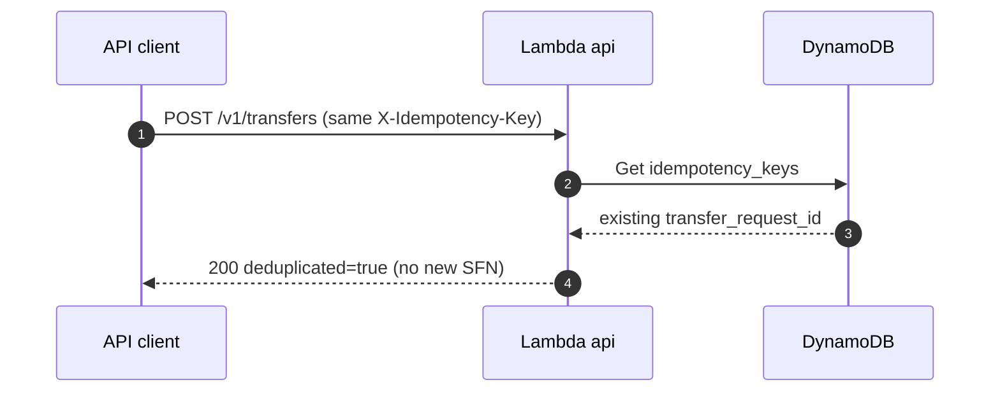

### UC-T06: Retry failed transfer

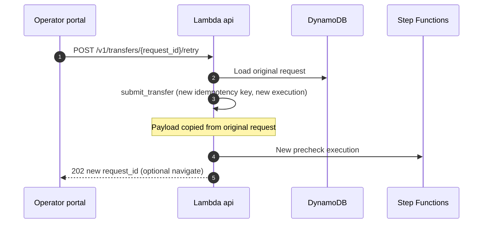

### UC-T07: Cancel in-flight transfer

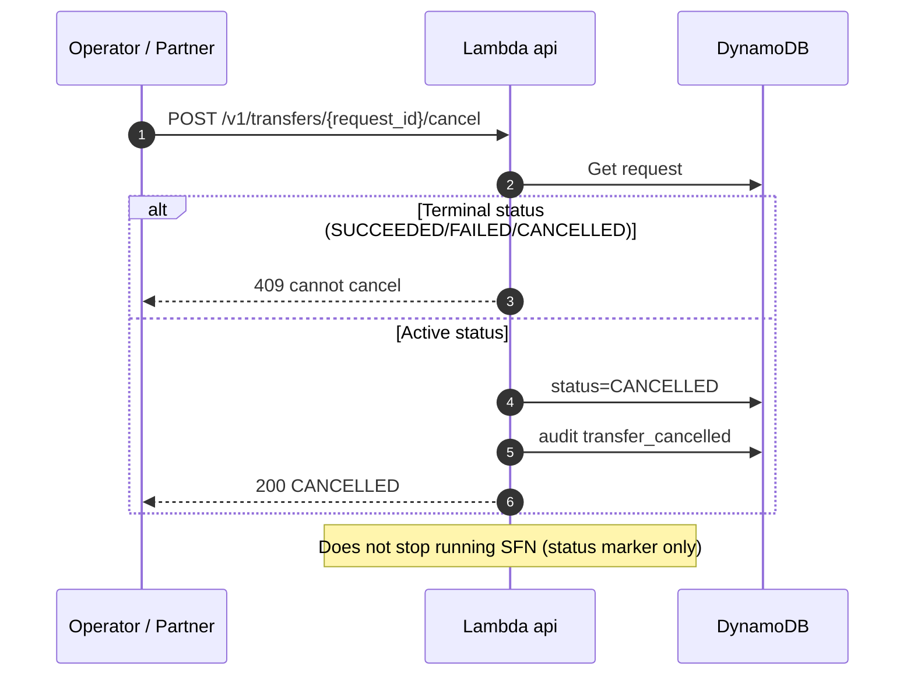

---

## Automation (EventBridge)

### UC-A01: Automation S3→S3 on object created

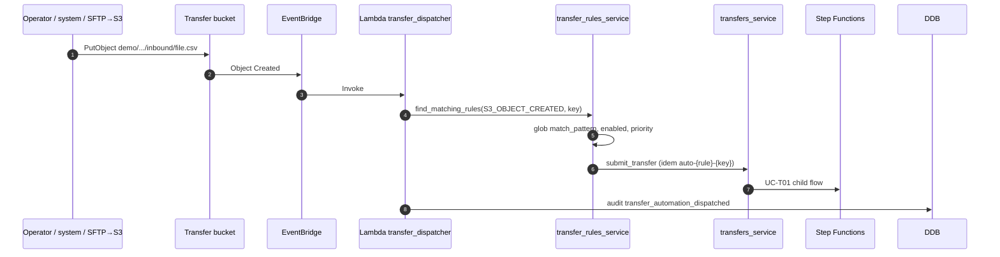

### UC-A02: Automation chain S3→SFTP → SFTP→S3

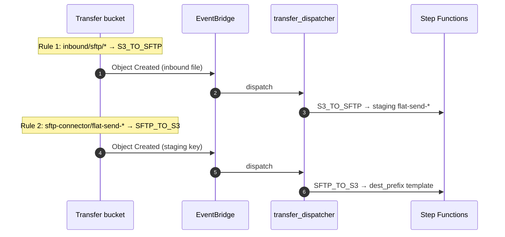

### UC-A03: Automation SFTP→SFTP on connector staging

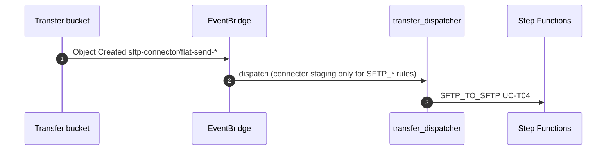

### UC-A04: Partner SFTP inbound → S3→S3 automation

Partner uses **managed SFTP server** (not connector). Files land under `sftp-inbound/`; automate with **S3→S3**, not SFTP→S3.

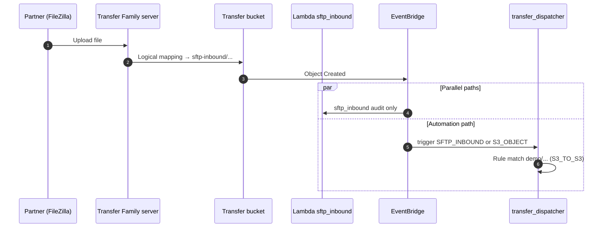

---

## Onboarding (self-service)

### UC-O01: Partner submits onboarding request

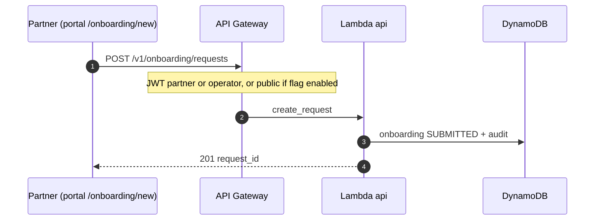

### UC-O02: Operator approves onboarding

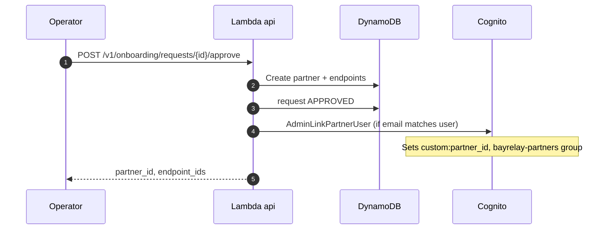

### UC-O03: Onboarding auto-approve (demo)

```mermaid
sequenceDiagram
  autonumber
  participant P as Applicant
  participant API as Lambda api
  participant DDB as DynamoDB

  P->>API: POST /v1/onboarding/requests
  API->>DDB: SUBMITTED
  API->>API: approve_request(reviewer=system-auto-approve)
  API->>DDB: partner + endpoints + APPROVED
  API-->>P: 201 auto_approved=true
```

### UC-O04: Operator rejects onboarding

```mermaid
sequenceDiagram
  autonumber
  participant Op as Operator
  participant API as Lambda api
  participant DDB as DynamoDB

  Op->>API: POST /v1/onboarding/requests/{id}/reject {reason}
  API->>DDB: status REJECTED, rejection_reason
  API->>DDB: audit onboarding_rejected
  API-->>Op: 200
```

---

## Portal (operator features)

### UC-PO01: Operator operations dashboard

```mermaid
sequenceDiagram
  autonumber
  participant Op as Operator browser
  participant Portal as Portal SPA
  participant APIGW as API Gateway
  participant API as Lambda api
  participant DDB as DynamoDB

  Op->>Portal: /operations
  Portal->>APIGW: GET /v1/ops/summary
  APIGW->>API: require_operator
  API->>DDB: Scan/sample partners, endpoints, transfers, onboarding
  API-->>Portal: KPIs, by_status, recent_transfers, health
  Portal-->>Op: LIVE badge, charts / overview
```

### UC-PO02: Operator creates transfer rule

```mermaid
sequenceDiagram
  autonumber
  participant Op as Operator
  participant Portal as Portal
  participant API as Lambda api
  participant DDB as DynamoDB

  Op->>Portal: /rules → Create rule form
  Portal->>API: POST /v1/transfer-rules
  API->>DDB: PutItem rule (enabled, priority, match_pattern, payload_template)
  API-->>Portal: 201 rule
  Note over S3: Next object match triggers UC-A01
```

### UC-PO03: Portal partner/endpoint CRUD

```mermaid
sequenceDiagram
  autonumber
  participant Op as Operator
  participant Portal as Portal
  participant API as Lambda api
  participant DDB as DynamoDB

  Op->>Portal: /partners search + Edit
  Portal->>API: PUT /v1/partners/{id}
  API->>DDB: Update partner
  Op->>Portal: Disable endpoint
  Portal->>API: DELETE /v1/endpoints/{id}
  API->>DDB: Soft delete status=DISABLED
```

---

## Agent & knowledge base

### UC-G01: Bedrock agent query with tools

```mermaid
sequenceDiagram
  autonumber
  participant Op as Operator portal
  participant APIGW as API Gateway
  participant API as Lambda api
  participant BR as Bedrock Agent
  participant Tools as Lambda agent_tools
  participant DDB as DynamoDB

  Op->>APIGW: POST /v1/agent/query {query, session_id}
  APIGW->>API: InvokeAgent
  BR->>Tools: Action group (planning / execution OpenAPI)
  Tools->>DDB: Read partners, transfers, policies
  Tools-->>BR: Tool results
  BR-->>API: Completion text (+ optional trace)
  API-->>Op: agent_response, session_id
```

### UC-G02: KB-grounded policy answer

```mermaid
sequenceDiagram
  autonumber
  participant Op as Operator
  participant API as Lambda api
  participant BR as Bedrock Agent
  participant KB as Bedrock Knowledge Base
  participant AOSS as OpenSearch Serverless

  Op->>API: POST /v1/agent/query (policy / retry question)
  API->>BR: InvokeAgent
  BR->>KB: Retrieve (vector search)
  KB->>AOSS: Query embeddings
  AOSS-->>KB: Chunks from customer runbooks
  KB-->>BR: Retrieved passages
  BR-->>Op: Grounded answer with citations
```

### UC-G03: Knowledge base sync and ingestion

```mermaid
sequenceDiagram
  autonumber
  participant Eng as Engineer / CI
  participant Script as kb_sync.sh + start_kb_ingestion.py
  participant S3 as KB source bucket
  participant KB as Bedrock KB
  participant BR as Bedrock Agent

  Eng->>Script: bootstrap_phase3.sh
  Script->>S3: Sync docs/kb/*.md
  Script->>KB: StartIngestionJob
  KB-->>Script: COMPLETE
  Script->>BR: PrepareAgent (alias)
  Note over BR: Agent queries use ingested docs (UC-G02)
```

---

## SFTP inbound (managed server)

### UC-S01: Partner upload via managed SFTP server

```mermaid
sequenceDiagram
  autonumber
  participant Partner as Partner SFTP client
  participant Srv as Transfer Family SFTP server
  participant S3 as S3 (logical home)
  participant EB as EventBridge
  participant Audit as sftp_inbound Lambda

  Partner->>Srv: SFTP PUT /file.dat
  Srv->>S3: Object sftp-inbound/.../file.dat
  S3->>EB: Object Created
  EB->>Audit: Audit sftp_inbound_object_created
  Note over S3: Use S3→S3 automation on sftp-inbound prefix (UC-A04)
```

---

## Operations & observability

### UC-M01: Audit trail and list audit events

```mermaid
sequenceDiagram
  autonumber
  participant Op as Operator
  participant API as Lambda api
  participant DDB as DynamoDB

  Note over DDB: Audits: transfer_submitted, onboarding_*, automation, sftp_inbound, cancel
  Op->>API: GET /v1/audit-events?q=&correlation_id=
  API->>DDB: Scan/filter audit_events
  API-->>Op: events[], count
```

### UC-M02: Ops summary dashboard data

```mermaid
sequenceDiagram
  autonumber
  participant Portal as Portal
  participant API as ops_service
  participant DDB as DynamoDB

  Portal->>API: GET /v1/ops/summary
  API->>DDB: Count partners, endpoints
  API->>DDB: Sample transfer_requests (status, type)
  API->>DDB: Sample executions (failed_recent)
  API->>DDB: Count onboarding SUBMITTED
  API-->>Portal: health, counts, recent_transfers
```

---

## Feature matrix (diagram coverage)

| Feature / use case | Diagram ID |
|--------------------|------------|
| Cognito operator login | UC-P01 |
| Cognito partner scoped access | UC-P02 |
| JWT enforcement | UC-P03 |
| Partner registry | UC-C01 |
| Routing policy DENY | UC-C02 |
| Manual S3→S3 / S3→SFTP / SFTP→S3 / SFTP→SFTP | UC-T00 + UC-T01–T04 |
| Idempotency | UC-T05 |
| Retry / cancel | UC-T06, UC-T07 |
| S3 event automation | UC-A01–A04 |
| Partner SFTP server upload | UC-S01, UC-A04 |
| Onboarding submit/approve/reject/auto | UC-O01–O04 |
| Portal ops dashboard | UC-PO01, UC-M02 |
| Automation rules UI | UC-PO02 |
| Partner/endpoint CRUD | UC-PO03 |
| Bedrock agent + tools | UC-G01 |
| RAG / KB | UC-G02, UC-G03 |
| Audit log API | UC-M01 |
| End-to-end customer story | UC-00 |

---

## Exporting diagrams

- **Regenerate all PNGs:** `./scripts/export_sequence_diagram_pngs.sh` (requires Node/npm; uses Chrome via Puppeteer, or falls back to [mermaid.ink](https://mermaid.ink)).
- **Output:** `docs/sequence-diagrams/png/UC-*.png` and source `.mmd` under `docs/sequence-diagrams/mmd/`.
- **Single diagram:** paste one ` ```mermaid ` block into [mermaid.live](https://mermaid.live) → Export PNG/SVG.
- **PDF pack:** attach PNGs or this file to proposals as a technical appendix (`export_sales_pdfs.sh` for one-pagers/SOWs).
- **Architecture deck:** UC-00, UC-T00, UC-A02, UC-O02 PNGs work well in executive + technical slides.

---

*Generated from BayRelay codebase (`app/lambdas/unified`, `modules/step_functions`, portal routes). Update when workflows or API contracts change.*
